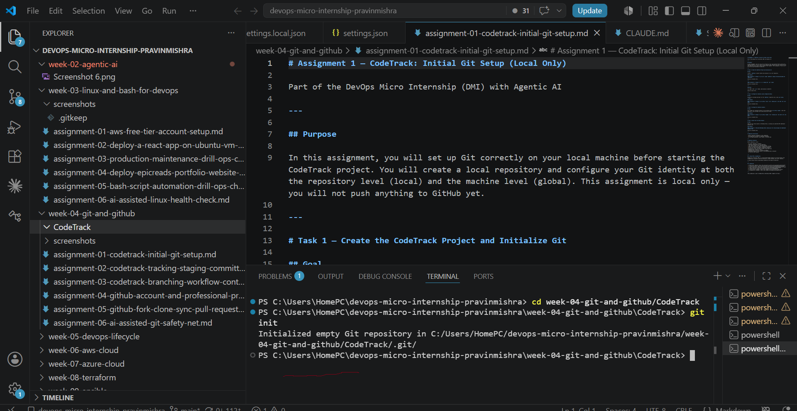
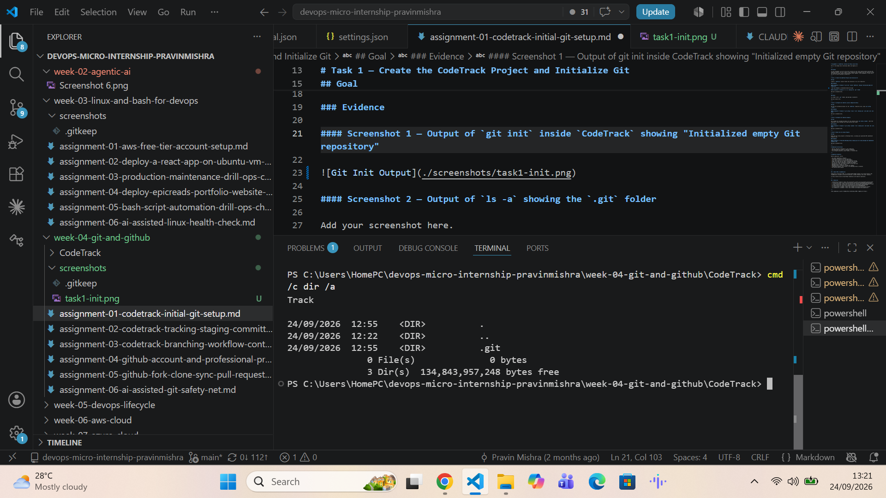
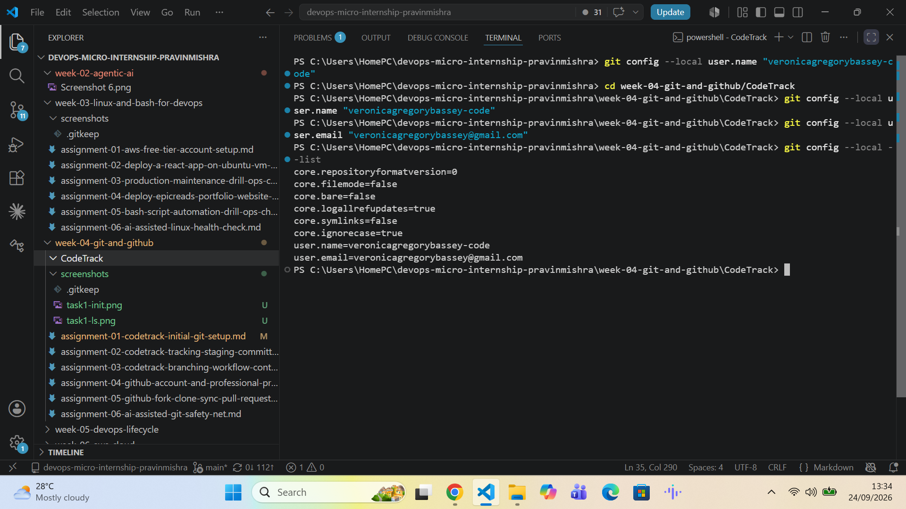
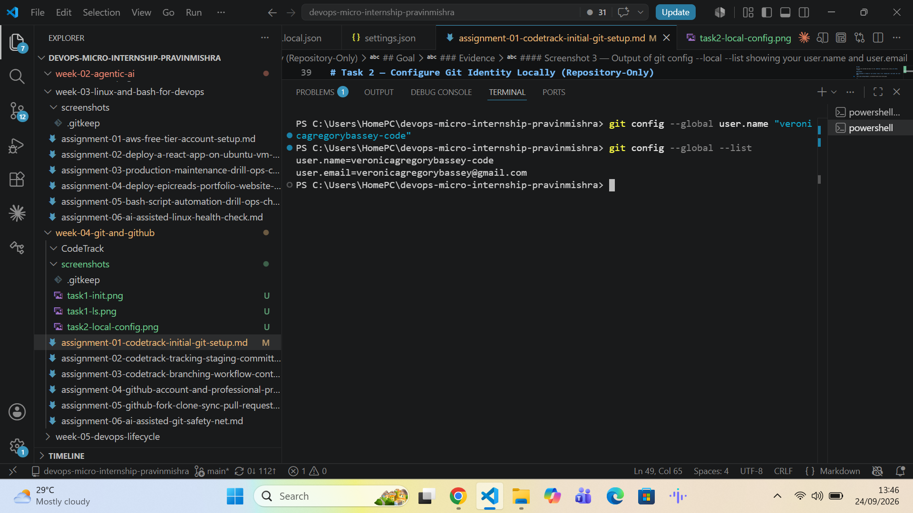

# Assignment 1 — CodeTrack: Initial Git Setup (Local Only)

Part of the DevOps Micro Internship (DMI) with Agentic AI

---

## Purpose

In this assignment, you will set up Git correctly on your local machine before starting the CodeTrack project. You will create a local repository and configure your Git identity at both the repository level (local) and the machine level (global). This assignment is local only — you will not push anything to GitHub yet.

---

# Task 1 — Create the CodeTrack Project and Initialize Git

## Goal

Create a `CodeTrack` project folder and initialize it as a Git repository.

### Evidence

#### Screenshot 1 — Output of `git init` inside `CodeTrack` showing "Initialized empty Git repository"

#### Screenshot 2 — Output of `ls -a` showing the `.git` folder

---

### Notes

**1. What is the `.git` folder, and why does it matter?**

The `.git` folder is a hidden directory created by Git to store all the repository's metadata, tracking information, configuration settings, and commit history. It matters because it turns a standard directory into a Git-controlled repository, allowing Git to track file changes over time.

---

# Task 2 — Configure Git Identity Locally (Repository-Only)

## Goal

Set your Git username and email for the `CodeTrack` repository only, using `git config --local`.

### Evidence

#### Screenshot 3 — Output of `git config --local --list` showing your `user.name` and `user.email`

---

# Task 3 — Configure Git Identity Globally

## Goal

Set a global Git username and email for this machine using `git config --global`. Note that CodeTrack's local settings still take priority over these.

### Evidence

#### Screenshot 4 — Output of `git config --global --list` showing your `user.name` and `user.email`

---

# Task 4 — Share Your Git Setup Progress

## Goal

Share your Git setup progress on WhatsApp Status, including your generated DMI leaderboard progress link.

### Evidence

#### Screenshot 5 — Published WhatsApp Status showing your Git setup message and leaderboard progress link

---

# Submission Instructions

- Add all required screenshots in your submission
- Full Name must be visible in required screenshots
- Do not expose passwords, access tokens, or private keys

---

# Completion Checklist

Before submission, verify:

- All tasks completed in sequence
- CodeTrack initialized as a Git repository
- .git folder visible in the required evidence
- Local user.name and user.email configured and verified
- Global user.name and user.email configured and verified
- All four Git setup screenshots included and readable
- Explanation of the .git folder written in your own words
- WhatsApp Status shared for Task 4
- WhatsApp Status screenshot included and readable
- Leaderboard progress link visible in the WhatsApp Status screenshot
- No sensitive data exposed

---

## 📌 About DMI & CloudAdvisory

DevOps Micro Internship (DMI) is a project-based DevOps program run by Pravin Mishra (The CloudAdvisory) focused on real-world execution, systems thinking, and career readiness.

It helps learners build strong DevOps foundations with hands-on experience.

---

## 📌 Resources

- 🌐 DMI Official Website: https://dmi.pravinmishra.com?utm_source=github&utm_medium=readme  
- 🎓 University: https://university.pravinmishra.com?utm_source=github&utm_medium=readme  
- 💬 Discord Community: https://discord.pravinmishra.com?utm_source=github&utm_medium=readme  
- 📝 Blog: https://dmi.pravinmishra.com/blog?utm_source=github&utm_medium=readme  
- ▶️ YouTube Playlist: https://www.youtube.com/playlist?list=PLFeSNDtI4Cho  
- 🔗 Pravin Mishra (LinkedIn): https://www.linkedin.com/in/pravin-mishra-aws-trainer/  
- 🏢 CloudAdvisory (LinkedIn): https://www.linkedin.com/company/thecloudadvisory/

---

*This submission is part of DevOps Micro Internship (DMI) — Agentic AI Track.*
